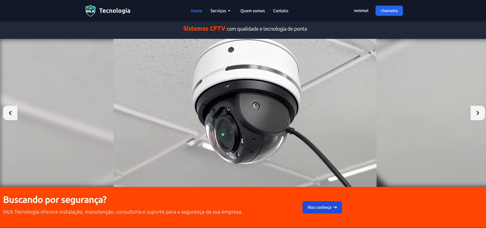

# MLK Tecnologia — Landing Page Institucional

Projeto como **Desenvolvedor Full Stack** de **Landing Page institucional** desenvolvido para a **MLK Tecnologia**, com foco em apresentação da empresa, serviços, canais de contato e suporte ao cliente.

O projeto é estático, performático e pensado para fácil manutenção, utilizando tecnologias modernas no frontend e integrações simples para formulários e atendimento.

---

Frontend

Backend & Serviços

---

## 🚀 Funcionalidades

- Apresentação institucional da empresa
- Seção de serviços e diferenciais
- Formulário de contato com envio de e-mail gratuito
- Página de agradecimento após envio do formulário
- Área de suporte com GLPI
- Área de geração de orçamento

---
